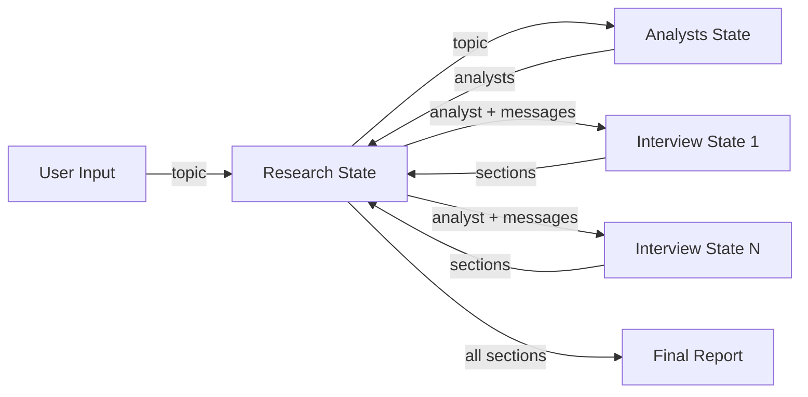

# Architecture Documentation

## Overview

The LangGraph Research Assistant is built as a hierarchical multi-agent system with three interconnected graphs. This document explains the design decisions, data flow, and extension points.

## Graph Architecture

### 1. Research Graph (Main Orchestrator)

**Purpose**: Coordinates the entire research workflow from analyst generation to final report assembly.

**State Schema**:
- **Input**: `ResearchInput` - Contains only the research topic
- **Output**: `ResearchOutput` - Contains the final formatted report
- **Internal**: `ResearchGraphState` - Tracks topic, analysts, sections, and report parts

**Flow**:
```
START
  ↓
Analysts Subgraph (generate analyst personas)
  ↓
Initiate Interviews (Send API - parallel execution)
  ↓
[conduct_interview] × N (one per analyst)
  ↓
Write Report Components (parallel)
  ├── write_introduction
  ├── write_report
  └── write_conclusion
  ↓
Finalize Report (reduce step)
  ↓
END
```

**Design Decisions**:
- Uses **Send API** for fan-out to multiple interview subgraphs
- Runs report writing nodes in **parallel** for efficiency
- Implements **map-reduce pattern**: map interviews → reduce to final report

### 2. Analysts Subgraph

**Purpose**: Generate AI analyst personas with diverse perspectives on the research topic.

**State Schema**:
- **Input**: `AnalystsInput` - Topic and optional feedback
- **Output**: `AnalystsOutput` - List of generated analysts
- **Internal**: `GenerateAnalystsState` - Includes max_analysts configuration

**Flow**:
```
START
  ↓
create_analysts (LLM generates analysts)
  ↓
human_feedback (interrupt for review)
  ├── If feedback provided → create_analysts (regenerate)
  └── If approved → END
```

**Design Decisions**:
- Uses **interrupt** for human-in-the-loop feedback
- **Command API** for conditional branching after interrupt
- Structured output (Pydantic) ensures type-safe analyst generation
- Configurable `max_analysts` (default: 2, range: 1-10)

### 3. Interview Subgraph

**Purpose**: Conduct research interview for a single analyst, searching for information and writing a section.

**State Schema**:
- **Input**: `InterviewInput` - Analyst persona and initial message
- **Output**: `InterviewOutput` - Written research section(s)
- **Internal**: `InterviewState` - Tracks conversation, sources, and configuration

**Flow**:
```
START
  ↓
ask_question (analyst asks question)
  ↓
[search_web + search_wikipedia] (parallel retrieval)
  ↓
answer_question (expert answers using sources)
  ↓
route_messages (check if interview complete)
  ├── Continue → ask_question
  └── Done → save_interview
      ↓
write_section (generate final section)
      ↓
END
```

**Design Decisions**:
- **Parallel search** from web (Tavily) and Wikipedia
- **Configurable turns** (max_num_turns: 1-20, default: 2)
- **Automatic termination** via:
  1. Max turns reached
  2. Closing phrase detected
- **Conversation state** tracked with add_messages reducer

## Data Flow

### State Propagation



### Key State Fields

**Parent → Child Communication**:
- Research → Analysts: `topic`
- Research → Interview: `analyst`, initial `messages`

**Child → Parent Communication**:
- Analysts → Research: `analysts` (list)
- Interview → Research: `sections` (accumulated via `operator.add`)

## Extension Guide

### Adding a New Analyst Type

1. Modify `Researcher/Analysts/schemas.py`:
```python
class Analyst(BaseModel):
    # Add new fields
    specialty: str = Field(description="Analyst's area of expertise")
```

2. Update prompts in `Researcher/Analysts/graph.py`

### Adding a New Data Source

1. Create new search function in `Researcher/Interview/nodes.py`:
```python
def search_custom_source(state: InterviewState) -> Dict[str, List[str]]:
    # Implement search logic
    return {"context": [formatted_results]}
```

2. Add node to graph in `Researcher/Interview/graph.py`:
```python
interview_builder.add_node("search_custom", search_custom_source)
interview_builder.add_edge("ask_question", "search_custom")
interview_builder.add_edge("search_custom", "answer_question")
```

### Customizing Interview Behavior

**Change termination criteria** - Modify `route_messages()`:
```python
# Add custom termination logic
if custom_condition(messages):
    return "save_interview"
```

**Adjust number of turns** - Set in state or configuration:
```python
# In InterviewInput or InterviewState
max_num_turns: int = 5  # Increase for more detailed interviews
```

## Best Practices

### LangGraph Patterns Used

1. **Input/Output/Internal State Separation**
   - Clear contracts between graphs
   - Type-safe with Pydantic validation
   - Documented with Field descriptions

2. **Send API for Fan-Out**
   - Parallel interview execution
   - Each analyst runs independently
   - Results aggregated via `operator.add`

3. **Command API for Conditional Flow**
   - Dynamic routing after human feedback
   - Explicit state updates with goto

4. **Interrupt for Human-in-the-Loop**
   - User review of generated analysts
   - Regeneration based on feedback

### Configuration Management

**Centralized Configuration** (`Researcher/configuration.py`):
- Single LLM instance shared across all graphs
- Environment variable support
- Easy to modify model/temperature

**Environment Variables**:
```bash
RESEARCHER_MODEL=gpt-4  # Change model
RESEARCHER_TEMPERATURE=0.7  # Adjust creativity
```

### Error Handling

**Current Implementation**:
- Specific exception handling (no bare `except`)
- Validation at Pydantic level
- Graceful degradation in `finalize_report`

**Future Improvements**:
- Add retry logic for LLM calls
- Implement fallback behavior for failed searches
- Add checkpointing for state persistence

## Performance Considerations

**Parallelization**:
- Interviews run in parallel (N analysts)
- Search operations run in parallel (web + Wikipedia)
- Report sections generated in parallel

**Bottlenecks**:
- LLM calls are sequential within each interview
- Human feedback interrupt blocks progress

**Optimization Opportunities**:
- Implement caching for repeated searches
- Batch LLM calls where possible
- Add timeout handling for long-running operations

## Testing Strategy

**Unit Testing** (recommended):
- Test individual node functions with mock states
- Test routing logic with various message patterns
- Test state transformations

**Integration Testing** (recommended):
- Test full graph execution end-to-end
- Test human feedback loop
- Test parallel execution behavior

**Current Verification**:
- `verify_schemas.py` - Validates state schemas
- `test_imports.py` - Ensures imports work

## Deployment

The project is configured for LangGraph Cloud deployment via `langgraph.json`:

```json
{
  "graphs": {
    "research": "Researcher/main.py:graph",
    "analysts": "Researcher/Analysts/main.py:graph",
    "interview": "Researcher/Interview/main.py:graph"
  }
}
```

Each graph can be deployed and invoked independently or as part of the complete research workflow.

## Future Enhancements

1. **Checkpointing**: Add state persistence for resumable workflows
2. **Streaming**: Implement streaming for real-time progress updates
3. **Error Recovery**: Add retry logic and fallback strategies
4. **Metrics**: Track interview quality and report generation metrics
5. **Customization**: Allow user to specify analyst criteria
6. **Export**: Support multiple output formats (PDF, HTML, Markdown)
