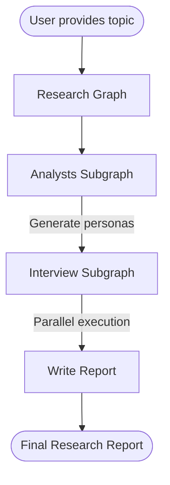

# LangGraph Research Assistant

A multi-agent research assistant built with LangGraph that conducts comprehensive research on any topic using AI analyst personas and structured interviews.

## Overview

This project implements a sophisticated research workflow that:
1. **Generates AI analyst personas** tailored to different perspectives on your research topic
2. **Conducts structured interviews** where each analyst asks questions and gathers information
3. **Synthesizes findings** into a comprehensive research report with introduction, body, and conclusion

## Architecture

The system is organized into **three main graphs**:



### 1. **Research Graph** (`Researcher/`)
The main orchestrating graph that coordinates the entire research process.

### 2. **Analysts Subgraph** (`Researcher/Analysts/`)
Generates AI analyst personas with different perspectives. Includes a human-in-the-loop interrupt for refining analyst selection.

### 3. **Interview Subgraph** (`Researcher/Interview/`)
Conducts research interviews where analysts ask questions, search for information via web and Wikipedia, and generate research sections.

## Installation

```bash
# Clone the repository
git clone <repository-url>
cd playground

# Install dependencies using uv
uv sync

# Set up environment variables
cp .env.example .env
# Add your API keys to .env
```

Required environment variables:
- `OPENAI_API_KEY` - OpenAI API key for LLM access
- `TAVILY_API_KEY` - Tavily API key for web search
- Optional: `RESEARCHER_MODEL` (default: gpt-5-nano)
- Optional: `RESEARCHER_TEMPERATURE` (default: 0)

## Usage

### Running with LangGraph Dev Server

```bash
# Start the development server
langgraph dev

# Access the UI at http://localhost:8123
```

### Running Programmatically

```python
from Researcher.graph import graph

# Run the research graph
result = graph.invoke({
    "topic": "The impact of AI on software development"
})

print(result["final_report"])
```

## Project Structure

```
playground/
├── Researcher/                  # Main package
│   ├── __init__.py
│   ├── graph.py                # Main research graph
│   ├── state.py                # State schemas
│   ├── nodes.py                # Node functions
│   ├── prompts.py              # LLM prompts
│   ├── configuration.py        # Shared configuration
│   ├── Analysts/              # Analyst generation subgraph
│   │   ├── graph.py
│   │   ├── state.py
│   │   └── schemas.py
│   └── Interview/             # Interview subgraph
│       ├── graph.py
│       ├── state.py
│       ├── nodes.py
│       ├── prompts.py
│       ├── schemas.py
│       └── tools.py
├── langgraph.json             # LangGraph configuration
├── pyproject.toml             # Project dependencies
└── README.md                  # This file
```

## Key Features

- **Multi-perspective Analysis**: Generates multiple AI analysts with different viewpoints
- **Human-in-the-Loop**: Allows human feedback on generated analysts before interviews
- **Parallel Execution**: Runs interviews in parallel using LangGraph's Send API
- **Web & Wikipedia Search**: Retrieves relevant information from multiple sources
- **Structured Output**: Generates well-formatted research reports

## Development

### Verification Scripts

```bash
# Verify imports
uv run python test_imports.py

# Verify schema configuration
uv run python verify_schemas.py
```

### Configuration

The project uses a centralized configuration in `Researcher/configuration.py`:
- Shared LLM instance across all subgraphs
- Environment variable support for model selection
- Consistent temperature settings

## Best Practices Implemented

This codebase follows LangGraph and Python best practices:

✅ **State Management**: Separate input, output, and internal state schemas  
✅ **Type Safety**: Comprehensive type hints and Pydantic validation  
✅ **Documentation**: Module and function docstrings throughout  
✅ **Configuration**: Centralized configuration with environment variable support  
✅ **Error Handling**: Proper exception handling with specific error cases  
✅ **Code Quality**: Extracted constants, meaningful names, clear structure

## License

[Add your license here]

## Contributing

[Add contribution guidelines here]
